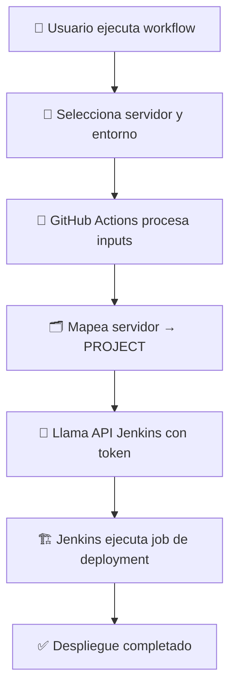

# 🚀 Deploy Manual - GitHub Actions + Jenkins

Este repositorio contiene un workflow de GitHub Actions para despliegue manual a servidores a través de Jenkins.

## 📋 Tabla de Contenidos

- [Configuración](#configuración)
- [Variables de Repositorio](#variables-de-repositorio)
- [Secretos](#secretos)
- [Cómo Funciona](#cómo-funciona)
- [Uso](#uso)
- [Troubleshooting](#troubleshooting)

## ⚙️ Configuración

### 1. Variables de Repositorio

En tu repositorio de GitHub, configura las siguientes variables:

**📍 Ubicación:** `Settings → Secrets and variables → Actions → Variables`

| Variable | Descripción | Ejemplo |
|----------|-------------|---------|
| `JENKINS_URL` | URL base de tu servidor Jenkins | `https://jenkins.tuempresa.com` |

#### ✅ Cómo configurar JENKINS_URL:
1. Ve a tu repositorio en GitHub
2. Click en **Settings**
3. En el menú lateral: **Secrets and variables → Actions**
4. Pestaña **Variables**
5. Click **New repository variable**
6. Name: `JENKINS_URL`
7. Value: `https://tu-servidor-jenkins.com` (sin `/` al final)

### 2. Secretos

**📍 Ubicación:** `Settings → Secrets and variables → Actions → Secrets`

| Secreto | Descripción | Dónde obtenerlo |
|---------|-------------|-----------------|
| `JENKINS_USER` | Usuario de Jenkins | Tu nombre de usuario en Jenkins |
| `JENKINS_TOKEN` | API Token de Jenkins | Generado en Jenkins (ver pasos abajo) |

#### 🔑 Cómo obtener JENKINS_TOKEN:

1. **Inicia sesión en Jenkins**
2. **Ve a tu perfil:**
   - Click en tu nombre (esquina superior derecha)
   - Selecciona **"Configure"**
3. **Genera el token:**
   - Busca la sección **"API Token"**
   - Click **"Add new Token"**
   - Dale un nombre: `GitHub Actions`
   - Click **"Generate"**
   - **⚠️ IMPORTANTE:** Copia el token inmediatamente (solo se muestra una vez)

#### ✅ Cómo configurar los secretos:
1. Ve a tu repositorio en GitHub
2. **Settings → Secrets and variables → Actions → Secrets**
3. **New repository secret** para cada uno:
   - Name: `JENKINS_USER` / Value: `tu-usuario-jenkins`
   - Name: `JENKINS_TOKEN` / Value: `el-token-que-copiaste`

## 🔧 Cómo Funciona

### Workflow: `deploid_manual.yml`

```yaml
name: 🚀 Deploy Manual
```

#### 📥 Inputs (Parámetros de entrada):

| Input | Descripción | Opciones |
|-------|-------------|----------|
| `servidor` | Servidor de destino | `des`, `devqa` |
| `entorno` | Ambiente de despliegue | `PRD`, `DES` |

#### ⚡ Steps (Pasos del workflow):

1. **Definir variables de entorno:**
   - Mapea `servidor` → `PROJECT` (job de Jenkins)
   - Obtiene la rama actual: `github.ref_name`
   - Define el entorno seleccionado

2. **Ejecutar job de Jenkins:**
   - Llama al API de Jenkins usando token
   - Pasa parámetros al job: `BRANCH`, `ENTORNO`, `SERVIDOR`

### 🗺️ Mapeo de Variables

| GitHub Actions | Jenkins Job | Descripción |
|----------------|-------------|-------------|
| `inputs.servidor = "des"` | `PROJECT = "DeployDes"` | Job para servidor desarrollo |
| `inputs.servidor = "devqa"` | `PROJECT = "DeployDevQA"` | Job para servidor dev/qa |
| `github.ref_name` | `BRANCH` | Rama actual del repositorio |
| `inputs.entorno` | `ENTORNO` | Ambiente (PRD/DES) |
| `inputs.servidor` | `SERVIDOR` | Servidor de destino |

### 🔄 Flujo Completo



## 🚀 Uso

### 1. Ejecutar Deployment Manual

1. Ve a tu repositorio en GitHub
2. Click en **Actions**
3. Selecciona **"🚀 Deploy Manual"**
4. Click **"Run workflow"**
5. Selecciona:
   - **🖥️ Servidor de despliegue:** `des` o `devqa`
   - **🌍 Entorno:** `PRD` o `DES`
6. Click **"Run workflow"**

### 2. Monitorear Ejecución

- Ve los logs en tiempo real en GitHub Actions
- Verifica el progreso en Jenkins
- Revisa el resultado del despliegue

## 🐛 Troubleshooting

### Errores Comunes

| Error | Causa | Solución |
|-------|-------|----------|
| `403 Forbidden` | Token inválido o expirado | Regenera el `JENKINS_TOKEN` |
| `404 Not Found` | URL incorrecta | Verifica `JENKINS_URL` |
| `Job not found` | Nombre de job incorrecto | Verifica mapeo `servidor → PROJECT` |
| `Authentication failed` | Usuario incorrecto | Verifica `JENKINS_USER` |

### ✅ Verificaciones

1. **Jenkins URL está bien configurada:**
   ```bash
   curl -I https://tu-jenkins.com/api/json
   # Debe retornar 200 o 403, no 404
   ```

2. **Token funciona:**
   ```bash
   curl -u "usuario:token" https://tu-jenkins.com/api/json
   # Debe retornar JSON sin error 403
   ```

3. **Jobs existen en Jenkins:**
   - Verifica que existan los jobs: `DeployDes` y `DeployDevQA`
   - Que tengan los parámetros: `BRANCH`, `ENTORNO`, `SERVIDOR`

## 📞 Soporte

Para problemas o mejoras:
1. Revisa los logs de GitHub Actions
2. Verifica la configuración en Jenkins
3. Consulta la documentación de GitHub Actions y Jenkins API

---

**🔧 Configurado y documentado para despliegues seguros y automatizados** 🚀


